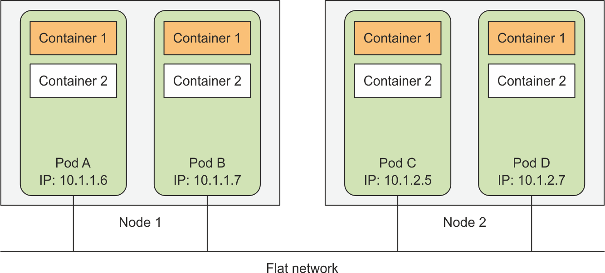
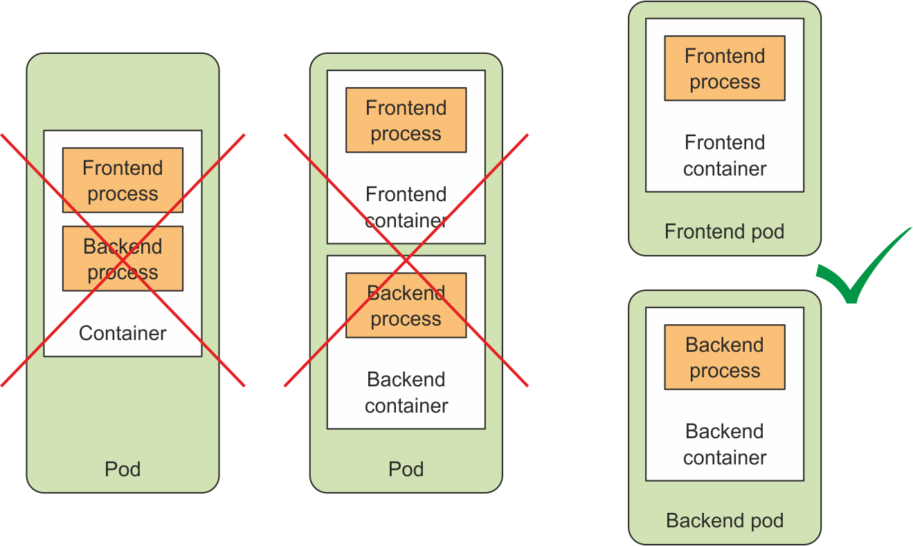
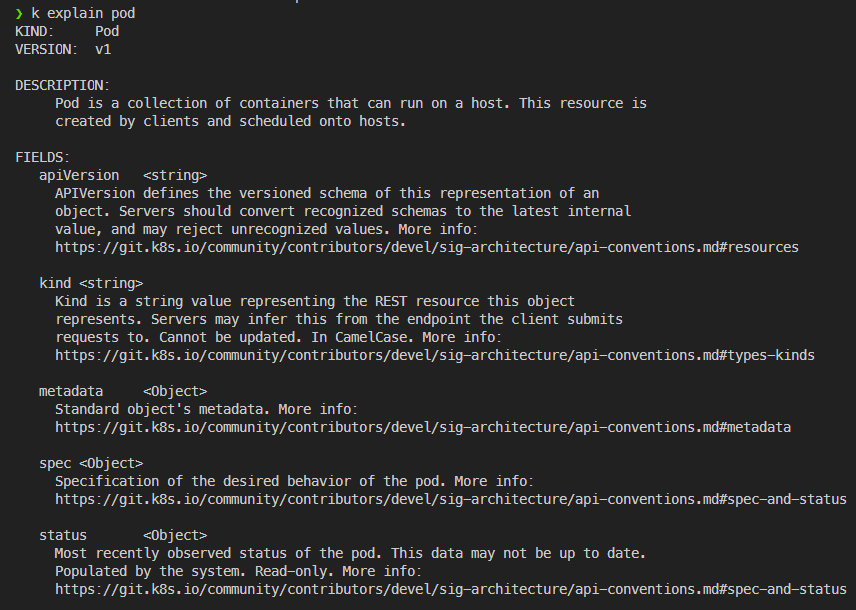
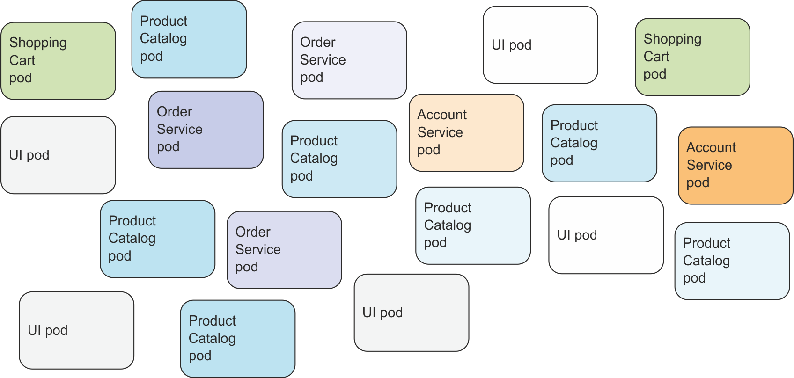
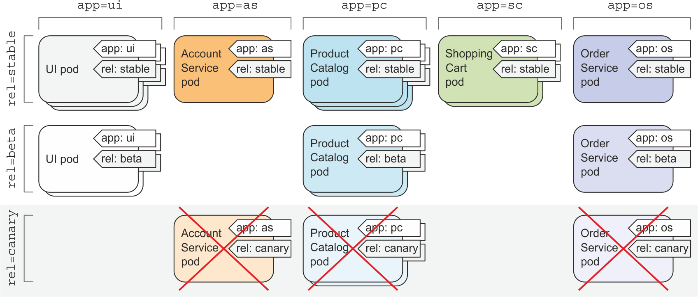

# 파드(pod): k8s에서 컨테이너 실행

## 3장 내용

- 파드의 생성, 실행, 정지
- 파드와 다른 리소스를 레이블로 조직화하기
- 특정 레이블을 가진 모든 파드에서 작업 수행
- 네임스페이스를 사용해 파드를 겹치지 않는 그룹으로 나누기
- 특정한 형식을 가진 워커 노드에 파드 배치

## 1. 파드 소개

- 함께 배치된 컨테이너 그룹
- 쿠버네티스의 기본 빌딩 블록
- 파드 안의 컨테이너들은 하나의 워커 노드에서 실행된다.

### 1.1 파드가 필요한 이유

- 각 프로세스는 하나의 컨테이너에서 실행돼야 한다. 하나의 컨테이너 내부에서 여러 프로세스가 실행됐을 때에는 쿠버네티스가 각 프로세스를 관리하기 어렵다. 로그 파악도 어렵다.
- 여러 프로세스를 하나의 컨테이너로 묶지 않기 때문에 컨테이너를 함께 묶고 하나의 단위로 관리할 수 있는 상위 구조가 필요하다. (=파드)
- 여러 컨테이너에 동일한 환경을 제공하면서도 각 컨테이너를 격리된 상태로 유지할 수 있다.

### 1.2 파드 이해하기

- 파드 안의 모든 컨테이너는 동일한 네임스페이스를 공유한다. 다만 파일시스템은 분리되어 있다. (이후 볼륨을 통해 공유할 수 있다)
- 파드 안 컨테이너가 동일한 네트워크 네임스페이스에서 실행되기 때문에 동일 IP주소와 포트 공간을 공유한다. 파드 안의 프로세스가 같은 포트 번호를 사용하지 않도록 주의해야 한다.
- 각 파드는 라우팅 가능한 IP 주소를 얻고 다른 파드에서 해당 IP주소를 통해 파드를 볼 수 있다.
  

### 1.3 파드의 적절한 구성



- 각 파드엔 밀접하게 관련 있는 구성요소나 프로세스만 포함한다. (vs 과거엔 한 호스트에 모든 유형의 애플리케이션을 넣었다)
  - 여러 노드가 있을 때 여러 파드로 나누어야 노드들을 분산해서 사용하기 편하다.
  - 개별적인 스케일링(확장)을 위해 여러 파드에 나누어서 배치한다.
  - 하나의 주요 프로세스와 다른 보조 프로세스로 구성됐을 때는 같은 파드에 컨테이너들을 배치한다.

## 2. YAML 또는 JSON 디스크립터로 파드 생성

파드를 정의하는 주요 부분

- Metadata: 이름, 네임스페이스, 레이블 및 파드에 관한 기타 정보
- Spec: 컨테이너, 볼륨, 기타 데이터 등 파드 자체에 관한 실제 명세
- Status: 파드 상태, 각 컨테이너 설명과 상태, 파드 내부 IP 등 현재 실행 중인 파드에 관한 정보를 포함 - 새 파드를 만들 땐 status 부분은 작성할 필요가 없다.

파드 매니페스트를 작성할 때 kubectl 명령어로 파드 속성에 관한 설명을 요청하는 것으로부터 시작할 수 있다.


```bash
> kubectl explain pod.spec
```

```
FIELDS:
   activeDeadlineSeconds        <integer>
     Optional duration in seconds the pod may be active on the node relative to
     StartTime before the system will actively try to mark it failed and kill
     associated containers. Value must be a positive integer.

   affinity     <Object>
     If specified, the pods scheduling constraints

   automountServiceAccountToken <boolean>
     AutomountServiceAccountToken indicates whether a service account token
     should be automatically mounted.

   containers   <[]Object> -required-
     List of containers belonging to the pod. Containers cannot currently be
     added or removed. There must be at least one container in a Pod. Cannot be
     updated.

   dnsConfig    <Object>
     Specifies the DNS parameters of a pod. Parameters specified here will be
     merged to the generated DNS configuration based on DNSPolicy.
    ...
```

### 2.3 create 명령으로 실행하기

```bash
kubectl create -f kubia-manual.yaml
k get pods kubia-manual -o yaml
k get po kubia-manual -o json
k get pods # 파드 목록에서 새로 생성된 파드 보기
```

### 2.4 애플리케이션 로그 보기

docker에서 보기

```bash
docker logs 8ae2df31cbc4 # container id
```

kubectl logs를 이용해 파드 로그 가져오기: 파드 로그를 보기 위해서 로컬 머신에서 다음 명령을 실행한다.

```bash
kubectl logs kubia-manual
kubectl logs kubia-manual -c kubia # kubia 컨테이너의 로그
```

### 2.5 파드에 요청 보내기

- port-forward로 로컬포트 8888을 파드의 8080포트로 연결하기

```bash
kubectl port-forward kubia-manual 8888:8080
```

- 로컬 포트로 파드에 연결할 수 있다.

```bash
curl localhost:8888
```

- 로컬 머신의 8888에서 쿠버네티스 클러스터의 8080포트로 연결하고 있고, 다른 쉘에서 로컬 8888로 접속해서 클러스터로 연결한다.


## 3. 레이블을 이용한 파드 구성

- 여러 버전과 릴리즈(안정, 베타, 카나리 등)의 마이크로서비스로 이뤄진 아키텍처일 경우 파드가 너무 많고 복잡해진다. 라벨이 필요하다.



### 3.1 레이블 소개

- 리소스에 첨부하는 key-value
- 일반적으로 리소스를 생성할 때 레이블을 붙이지만, 이후 수정할 수 있다.


app과 release 두 차원으로 레이블을 부여함

### 3.2 파드 생성시 레이블 지정

```yaml
# kubia-manual-with-labels.yaml
metadata:
  name: kubia-manual-v2
  labels:
    creation_method: manual # 두 가지 레이블을 붙여줬음
    env: prod
```

```bash
kubectl create -f kubia-manual-with-labels.yaml
kubectl get po --show-labels # label 함께 표기
kubectl get po -L creation_method,env # 지정한 label들이 각각 컬럼으로 생성
```

## 4. 레이블 셀렉터를 이용한 파드 부분집합 나열

특정 값과 레이블을 갖는지 여부에 따라 리소스를 필터링  
리소스 셀렉터 종류

- 특정 키를 포함하거나 포함하지 않는 레이블
- 특정 키와 값을 가진 레이블
- 특정 키를 갖고 있지만 다른 값을 가진 레이블

```bash
kubectl get po -l creation_method=manual # 특정 키-빌류를 가진 파드
kubectl get po -l env # env 레이블을 갖는 파드
kubectl get po -l '!env' # env 레이블을 갖고 있지 않는 파드, 따옴표를 꼭 붙여줘야 함! 느낌표 때문에.
kubectl get po -l app=pc,rel=beta # 여러 조건
```

- 레이블 셀렉터는 단순 파드 나열 뿐 아니라 부분 집합에 작업을 수행할 때도 사용할 수 있다.

## 5. 레이블과 셀렉터를 이용해 파드 스케줄링 제한

- 보통은 모든 노드에 무작위로 파드를 스케줄링하는 것이 바람직하다.
- 가끔은 스케줄링 위치에 영향을 주고 싶을 때가 있다. 노드의 리소스가 다를 때 (gpu 유무, HDD와 SSD 차이 등)

### 5.1 워커노드 분류에 레이블 사용

```bash
kubectl label node minikube gpu=true # 레이블 부여
kubectl get nodes -l gpu=true # 레이블셀렉터로 나열
```

### 5.2 특정 노드에 파드 스케줄링

```yaml
# kubia-gpu.yaml
metadata:
  name: kubia-gpu
spec:
  nodeSelector:
    gpu: "true" # nodeSelector를 통해 파드 스케줄링 노드 설정
  containers:
    - name: kubia
      image: luksa/kubia
```

- 레이블 셀렉터의 중요성과 유용함은 레플리케이션컨트롤러와 서비스를 이야기할 때 더욱 분명해진다. (4, 5장)

## 6. 파드에 어노테이션 달기

- 레이블 외에 어노테이션annotation을 가질 수 있다.
- 레이블과 달리 식별 정보를 갖지 않는다. 그룹으로 묶을 수 없다.
- 반면 레이블에 비해 더 많은 정보를 가질 수 있다.
- 새로운 기능을 추가할 때 흔히 사용한다. 일단 어노테이션 달고 이후에 실제 필드에 추가.
- 만든 사람 이름을 달아두어 협업에 사용할 수도 있다.

```bash
kubectl annotate kubia-manual mycompany.com/someannotations='foo bar'

kubectl describe kubia-manual # annotation 부분에 정상적으로 추가되어 있음을 알 수 있다.
```

## 7. 네임스페이스를 활용한 리소스 그룹화

- 오브젝트를 겹치지 않는 그룹으로 분할하고자 할 때.
- 리소스 이름은 네임스페이스 안에서만 고유하면 된다. 다른 네임스페이스에서 동일한 이름들을 사용할 수 있다.
- _노드 리소스는 네임스페이스에 속하지 않는다._

```bash
kubectl get ns # namespace 살펴보기
kubectl get po --namespace kube-system # 원래는 default ns만 조회가 되는데 특별히 지정해주면 이 ns의 리소스들이 나열된다.
kubectl get po -n kube-system # namespace 대신 n 사용 가능
```

### 7.3 네임스페이스 생성

쿠버네티스 리소스 중 하나이기 때문에 마찬가지로 yaml 파일을 쿠버네티스 서버에 요청해 생성할 수 있다.

```yaml
# custom-namespace.yaml
apiVersion: v1
kind: Namespace
metadata:
  name: custom-namespace
```

```bash
kubectl create -f custom-namespace.yaml
kubectl create namespace custom-namespace
```

### 7.4 다른 네임스페이스 오브젝트 관리

```bash
kubectl create -f kubia-manual -n custom-namespace
kubectl get pods -n custom-namespace
```

## 8. 파드 중지와 제거

```bash
kubectl delete pod kubia-gpu
kubectl delete pod kubia-gpu kubia-manual # 2개 이상의 파드에 명령

# 레이블 셀렉터를 활용한 삭제
kubectl delete po -l creation_method=manual
kubectl delete po -l rel=canary
```



```bash
# 네임스페이스를 활용한 파드 제거 - 네임스페이스 전체 삭제
kubectl delete ns custom-namespace
```

## 8.5 네임스페이스에서 (거의) 모든 리소스 삭제

```bash
kubectl delete all --all ## 모든 유형 + 모든 리소스 인스턴스 삭제 -> 시크릿 등은 삭제되지 않는다.
```

> 레플리케이션컨트롤러를 생성하고 그 다음 kubectl run으로 생성한 파드는 삭제 후 즉시 파드가 다시 생성된다. -> 레플리케이션컨트롤러 또한 삭제해줘야 한다.

## 9. 요약

- 특정 컨테이너를 파드로 묶어야 하는지 여부
- yaml로 디스크립터를 작성해 파드를 생성하고 정의와 상태를 확인할 수 있다.
- 레이블과 레이블 셀렉터를 사용해 파드를 조직하고 그룹화하여 작업할 수 있다.
- 노드 레이블과 셀렉터를 사용해 특정 기능을 가진 노드에 파드를 스케줄링 할 수 있다.
- 어노테이션을 사용하여 사람, 도구, 라이브러리에서 더 큰 데이터를 파드에 부착할 수 있다.
- 네임스페이스는 동일한 클러스터를 별도로 사용하는 것처럼 나눌 수 있게 해준다.
