# 레플리케이션과 그 밖의 컨트롤러: 관리되는 파드 배포

## 4장 내용

- 파드의 안정적인 유지
- 동일한 파드의 여러 인스턴스 실행
- 노드 장애 시 자동으로 파드 재스케줄링
- 파드의 수평 스케줄링
- 각 클러스터 노드에서 시스템 수준의 파드 실행
- 배치 잡 실행
- 잡을 주기적 또는 한 번만 실행하도록 스케줄링

## 1. 파드를 안정적으로 유지하기

### 1.1 라이브니스 프로브

- 컨테이너가 살아있는지 확인
- 파드의 스펙에 각 컨테이너의 라이브니스 프로브를 지정할 수 있다.
  쿠버네티스가 사용하는 세 가지 메커니즘
- http get 프로브: 지정한 IP 주소, 포트, 경로에 HTTP GET 요청을 수행. 서버가 오류 응답 코드를 반환하거나 응답하지 않으면 실패한 것으로 간주하여 컨테이너를 재시작
- TCP 소켓 프로브: 컨테이너 지정된 포트에 TCP 연결 시도
- Exec 프로브: 컨테이너 내에 임의의 명령을 실행하고 명령의 종료 상태 코드를 확인한다. 상태코드가 0이면 성공, 다른 코드는 실패로 간주한다.

### 1.2 HTTP 기반 라이브니스 프로브 생성

```yaml
# kubia-liveness-probe.yaml
spec:
  containers:
    - name: kubia
      image: luksa/kubia-unhealthy
      livenessProbe:
        httpGet:
          path: / # http 요청 경로
          port: 8080 # 프로브가 연결해야 하는 네트워크 포트
```

- kubectl get pods를 해보면 2분 간격으로 재시작되고 있음을 알 수 있다.
  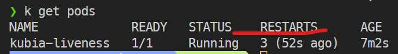
- kubectl describe {POD}를 해보면 last state에 종료된 내역이 표기가 되고 event도 남는다.
  > 컨테이너가 다시 시작된다는 것은 같은 컨테이너가 실행되는 게 아니다. 새로운 컨테이너가 생성된다.

### 1.4 라이브니스 프로브의 추가 속성

```
Liveness:       http-get http://:8080/ delay=0s timeout=1s period=10s #success=1 #failure=3
```

- delay=0s 컨테이너 시작 후 바로 라이브니스 프로브 실행
- timeout=1s 제한 시간 1초, 컨테이너가 1초 안에 응답해야 한다.
- period=10 컨테이너는 10초마다 프로브를 실행한다.
- failure=3 프로브가 3번 연속 실패하면 컨테이너가 다시 시작된다.

```yaml
livenessProbe:
  httpGet:
    path: /
    port: 8080
  initialDelaySeconds: 15 # 초기 지연값
```

```
Liveness:       http-get http://:8080/ delay=15s timeout=1s period=10s #success=1 #failure=3
```

> 애플리케이션의 시작 시간을 고려해 초기 지연값을 정해야 한다.

### 1.5 효과적인 라이브니스 프로브 생성

라이브니스 프로브가 확인해야할 사항

- 운영 환경에서는 라이브니스 프로브가 필수이다. 쿠버네티스가 애플리케이션이 살아 있는지 알 수 있는 방법이 없다.
- 특정 URL 경로에 요청하도록 구성해 애플리케이션 내에서 실행 중인 모든 주요 구성 요소가 살아 있는지 확인할 수 있다. (HTTP 엔드포인트에 요청)
- 외부 요인에 영향을 받지 않고 자체 기능에 문제가 있을 때 실패를 반환해서는 안 된다. 근본적인 원인이 외부에 있을 경우 해당 컨테이너를 재시작한다 하더라도 문제가 해결되지 않는다.

프로브를 가볍게 유지하기

- 연산 리소스 최소화, 시간이 오래 걸리지 않아야 한다. 비교적 자주 실행되며 1초 내 완료되어야 한다.
- 프로브의 시간도 컨테이너의 cpu 시간 할당량에 포함된다. 무거워지면 메인 프로세스의 시간이 줄어들게 된다.

프로브에 재시도 루프를 구현하지 마라

- 프로브가 여러 차례 실패해야 컨테이너가 종료된다. 그러나 임계값을 1로 설정하더라도 쿠버네티스는 실패를 한 번 했다고 간주하기 전에 몇 차례 프로브를 재시도 한다. 루프를 구현할 필요 없다.

> 노드 자체에 크래시가 발생했을 경우 컨테이너를 재시작 할 수 없다. 다른 노드에서 재시작되도록 하려면 레플리케이션컨트롤러나 이와 유사한 메커니즘으로 파드를 관리해야 한다.

## 2. 레플리케이션컨트롤러

- 쿠버네티스 리소스로서 파드가 항상 실행되도록 보장한다.
- 노드가 사라져도 노드를 바꿔서 재실행한다.

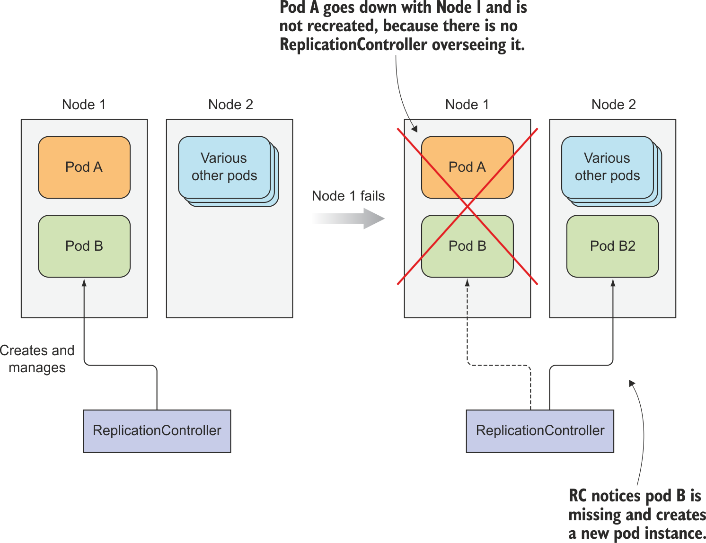
node1에 문제가 생겨도 레플리케이션컨트롤러가 관리하는 pod B는 node2에서 재실행된다.

> 레플리케이션컨트롤러는 하나의 파드만 관리하지만 일반적으로 파드의 여러 복제본(레플리카)을 작성하고 관리하기 위한 것이다. replication controller 이름의 유래이다.

### 2.1 레플리케이션컨트롤러의 동작

- 실행 중인 파드 목록을 지속적으로 모니터링하고, 특정 type의 실제 파드수가 의도하는 수와 일치하는지 항상 확인한다.
- 적게 실행 중인 경우 파드 템플릿에서 새 복제본을 만든다. 초과하는 경우 복제본이 제거된다.
  복제본이 많이 생긴 경우
- 누군가 같은 유형의 파드를 수동으로 만든다.
- 누군가 기존 파드의 type을 변경한다.
- 누군가 의도하는 파드 수를 줄인다.

> 파드 type이라기 보다는 특정 레이블 셀렉터와 일치하는 파드 세트에 작동한다.

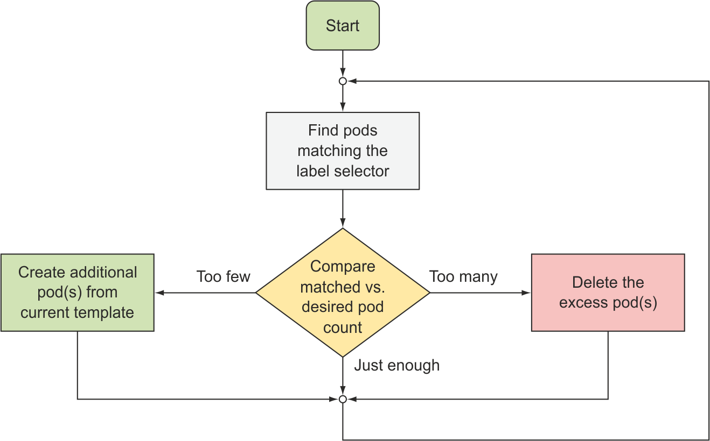

세 가지 필수 요소

- 레이블 셀렉터(label selector): 레플리케이션컨트롤러 범위에 있는 파드를 결정
- 레플리카 수(replica count): 실행할 파드의 의도하는(desired) 수 지정
- 파드 템플릿(pod template): 새로운 파드 레플리카를 만들 때 사용된다.
- 모두 변경할 수 있지만 레플리카 수의 변경만 기존 파드에 영향을 미친다.
- 레이블 셀렉터가 변경되면 레플리케이션컨트롤러가 지금부터 관리하는 파드가 달라진다.
- 템플릿은 레플리케이션컨트롤러가 새 파드를 생성할 때만 영향을 미친다.

  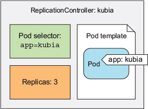

**레플리케이션컨트롤러 사용 이점**

- 기존 파드가 사라지면 새 파드를 시작해서 파드가 항상 유지되도록 한다.
- 노드에 장애가 발생하면 해당 노드의 파드들의 복제본이 생성된다. (파드는 노드를 교체하지 않는다. 다른 노드에 새롭게 파드를 생성한다.)
- 수동 또는 자동으로 파드를 수평으로 확장할 수 있게 한다.

### 2.2 레플리케이션컨트롤러 생성

```yaml
# kubia-rc.yaml
apiVersion: v1
kind: ReplicationController
metadata:
  name: kubia
spec:
  replicas: 3
  selector:
    app: kubia # 이게 설정되지 않으면 아래 템플릿의 레이블로 자동 설정된다.
template:
  metadata:
    labels:
      app: kubia
  spec:
    containers:
      - name: kubia
        image: luksa/kubia
        ports:
          - containerPort: 8080
```

- 레이블 셀렉터 app=kubia와 일치한느 파드 인스턴스가 3갤르 유지하도록 한다.
- 템플릿의 파드 레이블은 레플리케이션컨트롤러의 레이블 셀렉터와 완전히 일치해야 한다. 그렇지 않으면 새 파드를 무한정 생성하게 될 수 있다. 해당되는 파드의 숫자가 늘어나지 않기 때문에
- 셀렉터를 지정하지 않으면 템플릿의 레이블로 자동 설정된다.

```bash
kubectl create -f kubia-rc.yaml
kubectl get pods # replicas: 3 개수만큼 kubia 라는 이름의 파드가 생성된다.
```

삭제된 파드에 대한 컨트롤러의 반응 확인

```bash
kubectl delete pod kubia-8nsmr
```

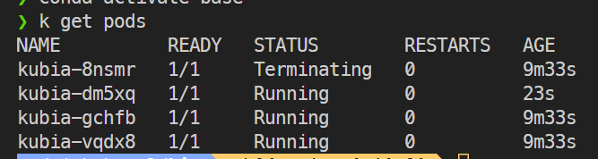

레이블을 변경해보기

```bash
kubectl label pod kubia-dm5xq type=special
kubectl label pod kubia-vqdx8 app=foo --overwrite
```

- 새로운 레이블을 추가해줬을 때: app=kubia 라벨은 그대로 있기 때문에 레플리카의 수는 3개 그대로 유지
- 하나의 파드의 레이블을 app=kubia가 아닌 걸로 바꿔줬을 때: app=kubia 파드 수를 3개로 맞추기 위해 새로운 파드 생성
  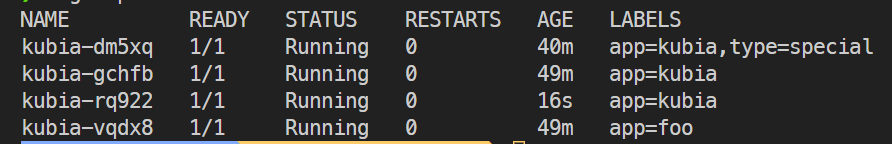

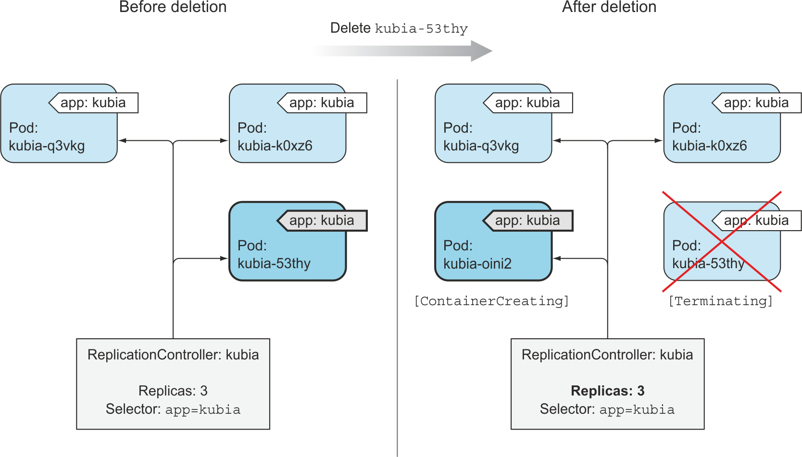

- app=kubia를 제거해준 파드가 레플리케이션컨트롤러의 컨트롤에서 벗어나게 된다. -> 삭제해도 아무일도 일어나지 않는다.

- 파드가 오작동할 때는 레플리케이션컨트롤러 범위에서 꺼내서 테스트 한 후 삭제한다.
- 컨트롤러의 레이블 셀렉터를 변경할 수 있다. 파드를 관리하는 다른 리소스들은 레이블 셀렉터를 변경할 수 없지만 레플리케이션컨트롤러는 가능하다.

### 2.5 파드 템플릿 변경

새로 생성될 파드에만 영향을 미친다.

```bash
kubectl edit rc kubia # rc.yaml 정의가 열린다. 여기서 수정 가능
```

### 2.6 수평 파드 스케일링

- replica 값을 변경한다. 기존 파드가 많으면 일부를 삭제하고, 적으면 추가로 생성한다.

```bash
kubectl scale rc kubia --replicas=10

kubectl edit rc kubia
```

### 2.7 레플리케이션컨트롤러 삭제

- cascade=false 값을 주면 컨트롤러 영향에 있는 파드들은 그대로 유지한 채 rc만 삭제가 된다.
- 이후 적절한 레이블 셀렉터를 사용하는 새 rc를 작성해 관리할 수 있다.

```bash
kubectl delete rc kubia --cascade=false
```

## 3. 레플리케이션컨트롤러 대신 레플리카셋 사용하기

> 레플리케이션컨트롤러를 대체하게 될 것이다.

- 특정 레이블이 없는 파드나 특정 레이블의 키를 갖는 파드를 매칭할 수 있다. (cf. rc는 특정 레이블이 있는 파드만 매칭 가능)
- 두 가지 이상의 레이블을 갖는 파드 세트들을 모두 매칭시켜 하나의 그룹으로 취급할 수 있다.
- 특정 키가 존재하는 파드들을 매칭할 수 있다. (env키가 있는 레이블을 갖는 파드들)

```yaml
# kubia-replicaset.yaml
apiVersion: apps/v1 # apps/v1beta2에서 v1으로 바뀜
kind: ReplicaSet
metadata:
  name: kubia
spec:
  replicas: 3
  selector:
    matchLabels:
      app: kubia
  template:
    metadata:
      labels:
        app: kubia
    spec:
      containers:
        - name: kubia
          image: luksa/kubia
```

- selector 아래에 바로 레이블을 넣지 않고 matchLabels를 만들어서 그 아래에 넣는다.

```yaml
# kubia-replicaset-matchexpressions.yaml
spec:
  replicas: 3
  selector:
    matchExpressions:
      - key: app
        operator: In
        values:
          - kubia
```

- In: 레이블의 값이 지정된 값 중 하나와 일치해야 한다.
- NotIn: 레이블의 값이 지정된 값과 일치하지 않아야 한다.
- Exists: 지정된 키를 가진 레이블이 포함돼야 한다. (값은 중요하지 않음) 이 연산자를 사용할 때는 값(value) 필드를 지정하지 않아야 한다.
- DoesNotExist는 파드에 지정된 키를 가진 레이블이 포함되어 있지 않아야 한다. 값 필드는 지정하지 않는다.

_레플리케이션컨트롤러와 마찬가지로 레플리카셋을 삭제해도 라벨로 연결된 파드들이 삭제된다._

## 4. 데몬셋을 사용해 각 노드에서 한 개의 파드 실행하기

레플리카셋과 달리 데몬셋은 각 노드에 한 개의 파드만 실행시킬 때 사용한다.  
시스템 수준의 작업을 수행하는 인프라 관련 파드가 이런 경우다.  
로그 수집기, 리소스 모니터 등
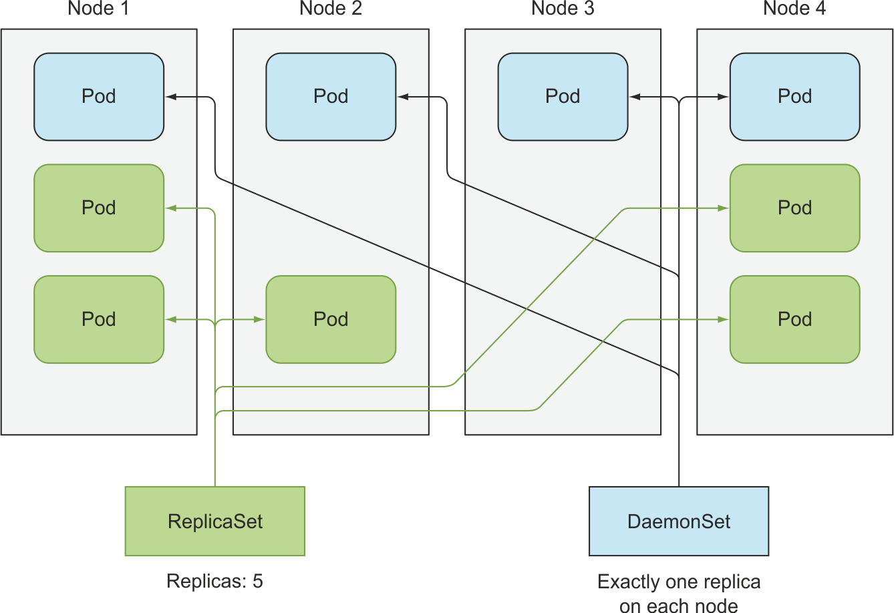

- 노드가 다운되면 데몬셋은 다른 곳에서 파드를 생성하지 않는다.
- 노드가 추가되면 데몬셋은 새 파드 인스턴스를 새 노드에 배포한다.
- 실수로 파드 중 하나를 삭제해 노드에 데몬셋 파드가 없는 경우에도 새 파드를 배포한다.
- 파드 템플릿으로 파드를 생성한다.
- 스케줄러와 관계 없이 모든 노드에 배포된다.
  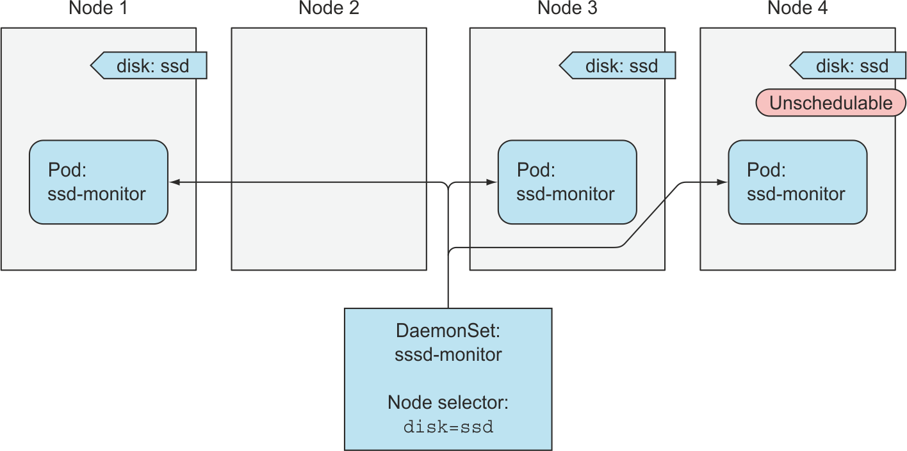

SSD를 갖는 모든 노드에서 실행돼야 하는 ssd--monitor 데몬. disk=ssd 라벨을 가지고 있는 노드에서 하나씩 실행된다.

```yaml
# ssd-monitor-daemonset.yaml
apiVersion: apps/v1
kind: DaemonSet
metadata:
  name: ssd-monitor
spec:
  selector:
    matchLabels:
      app: ssd-monitor
  template:
    metadata:
      labels:
        app: ssd-monitor
    spec:
      nodeSelector: # disk=ssd 레이블을 갖는 노드에 배포
        disk: ssd
      containers:
        - name: main
          image: luksa/ssd-monitor
```

```bash
kubectl label node minikube disk=ssd # 노드에 레이블링
kubectl create -f ssd-monitor-daemonset.yaml
kubectl get pods
kubectl get ds # daemonset
```

```bash
kubectl label node minikube disk=hdd --overwrite # disk 레이블을 바꿔주면 데몬셋이 배포한 파드가 종료된다
kubectl delete ds ssd-monitor # 데몬셋을 삭제하면 데몬셋이 배포한 파드들도 삭제된다.
```

## 5. 완료 가능한 단일 태스크를 수행하는 파드 실행
잡 리소스
- 프로세스가 한번 실행되면 파드를 종료시킨다. 
- 노드에 장애가 났을 때는 컨테이너를 재시작할 수 있다.

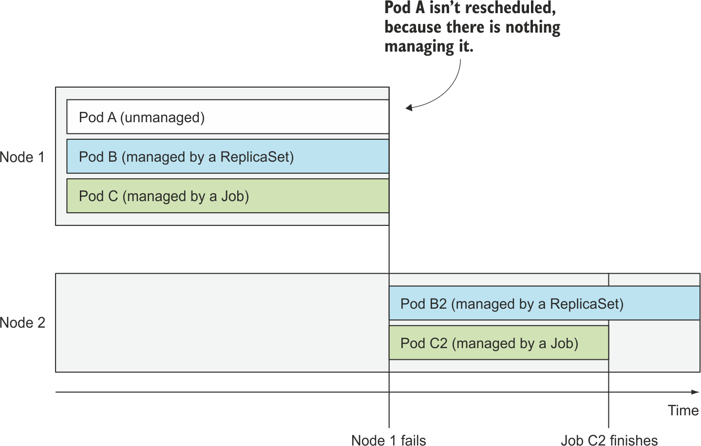

~~~yaml
# batch-job.yaml
apiVersion: batch/v1
kind: Job
metadata:
  name: batch-job
spec:
  template:
    metadata:
      labels:
        app: batch-job
    spec:
      restartPolicy: OnFailure # {OnFailure, Never}
      containers:
      - name: main
        image: luksa/batch-job
~~~
- job을 실행시키면 batch-job-bx6q4와 같은 파드가 하나 바로 실행된다. job에서 설정해준 restartPolicy를 갖는다.
- 위 이미지는 2분이 지나면 작업이 완료된다. pod도 완료된(completed) 상태가 된다.

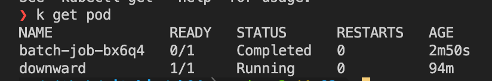

## 5.4 잡에서 여러 파드 실행하기
두 개 이상의 파드를 생성해 병렬/순차적으로 실행하도록 구성할 수 있다. 잡 스펙에 completions와 parallelism 속성을 설정해 수행한다.

순차적으로 잡 파드 실행하기: 잡의 파드를 몇 번 실행할지 completions에 설정한다. 다섯 개의 파드가 완료될 때까지 순차적으로 생성해준다.
~~~yaml
# multi-completion-batch-job.yaml
kind: Job
metadata:
  name: multi-completion-batch-job
spec:
  completions: 5 # completions 설정
  template:
    metadata:
      labels:
        app: batch-job
~~~

병렬로 잡 파드 실행하기: 여러 파드를 병렬로 실행한다. 
~~~yaml
# multi-completion-parallel-batch-job.yaml
kind: Job
metadata:
  name: multi-completion-batch-job
spec:
  completions: 5
  parallelism: 2 # 두 개까지 병렬 실행 가능
~~~
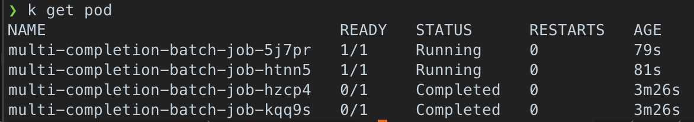


parallelism을 2에서 3으로 수정. 즉시 하나의 파드가 더 생성된다.
~~~bash
> kubectl scale job multi-completion-batch-job --replicas 3
Error from server (NotFound): the server could not find the requested resource
~~~

### 5.5 잡 파드가 완료되는 데 걸리는 시간 제한하기
~~~yaml
# time-limited-batch-job.yaml
apiVersion: batch/v1
kind: Job
metadata:
  name: time-limited-batch-job
spec:
  activeDeadlineSeconds: 30
  template:
    metadata:
      labels:
        app: batch-job
    spec:
      containers:
      - name: main
        image: luksa/batch-job
      restartPolicy: OnFailure
~~~
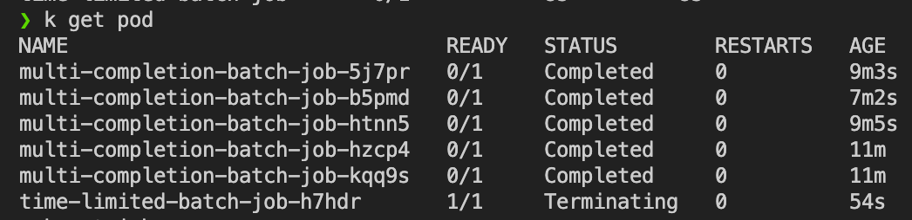

## 6. 잡을 주기적으로 또는 한 번 실행되도록 스케줄링 하기
크론잡: 지정된 간격으로 반복 실행되는 작업
~~~yaml
# cronjob.yaml
apiVersion: batch/v1
kind: CronJob
metadata:
  name: batch-job-every-fifteen-minutes
spec:
  schedule: "0,15,30,45 * * * *" # 매일, 매 시간 0, 15, 30, 45분에 실행
  jobTemplate:
    spec:
      template:
        metadata:
          labels:
            app: periodic-batch-job
        spec:
          restartPolicy: OnFailure
          containers:
          - name: main
            image: luksa/batch-job
~~~

- schedule: 분 시 일 월 요일 순
  - 매달 첫째날 30분마다 실행: "0,30 * 1 * *"
  - 일요일 3AM 마다 실행: "0 3 * * 0" (마지막 0이 일요일)
- 잡이나 파드가 상대적으로 늦게 생성될 수 있다. 특정 시간을 초과해서 늦게 생성되면 안된다는 기준을 제시할 수 있다.

~~~yaml
spec:
  schedule: "0,15,30,45 * * * *"
  startingDeadlineSeconds: 15
~~~
10시 15분에 잡이 실행된다고 할 때 10시 15분 15초까지 시작하지 않으면 실패로 표시된다.
## 7. 요약
- 컨테이너가 정상적이지 않다면, 쿠버네티스가 컨테이너를 다시 시작하도록 라이브니스 프로브를 지정할 수 있다. (정상인지 아닌지 판단하는 작업)
- 파드가 실수로 삭제되거나 노드에 장애가 발생하면 다시 실행되지 않는다. (직접 파드를 실행했을 때는)
- 레플리케이션컨트롤러는 의도하는 수의 파드 복제본(replica)을 항상 유지한다.
- 파드를 수평으로 스케일링하려면, 레플리케이션컨트롤러에 replica 수를 변경하면 된다.
- 파드는 레플리케이션컨트롤러가 소유하지 않으며, 레플리케이션컨트롤러 간 이동할 수 있다.
- RC는 템플릿에 따라 새로운 파드를 생성한다. 템플릿을 변경하더라도 기존 파드는 영향을 받지 않는다.
- RC는 RS(레플리카셋)와 디플로이먼트로 교체해야 한다.
- 데몬셋은 모든 노드에 데몬셋이 정의한 파드를 하나씩 실행되도록 한다.
- 배치 작업을 수행하는 파드는 잡 리소스로 생성해야 하며, 직접 생성하거나 레플리케이션컨트롤러나 유사한 오브젝트로 생성하지 말아야 한다.
- 나중에 주기적으로, 또는 한 번 실행해야 하는 잡은 크론잡을 통해 생성할 수 있다.