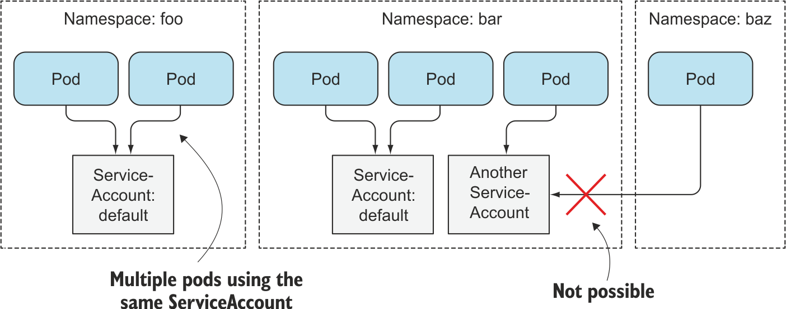
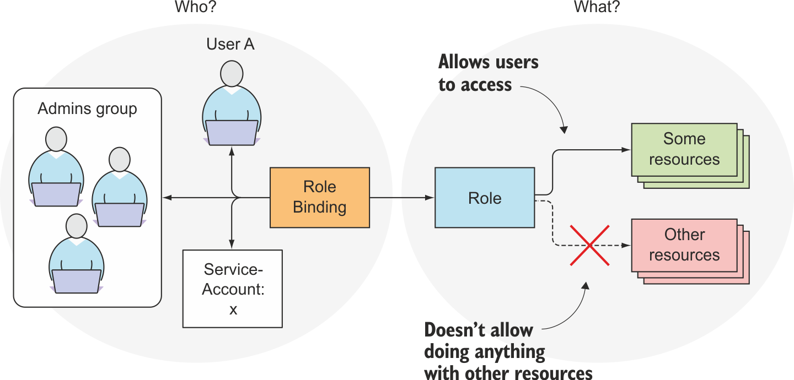
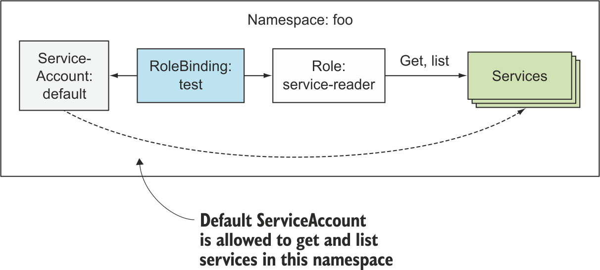
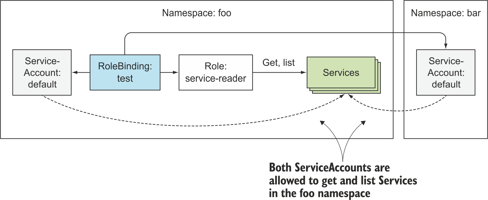
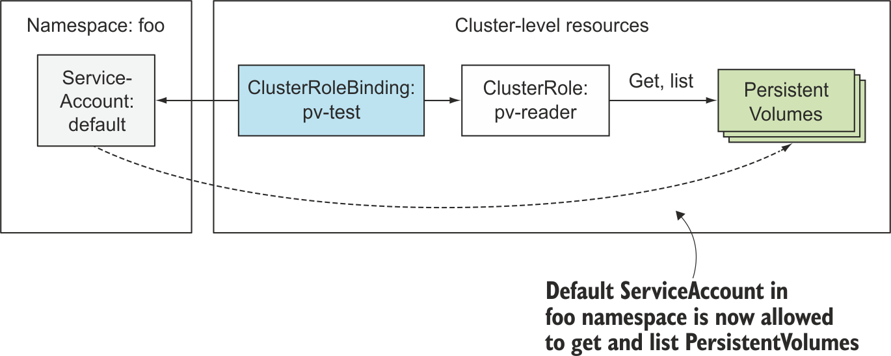
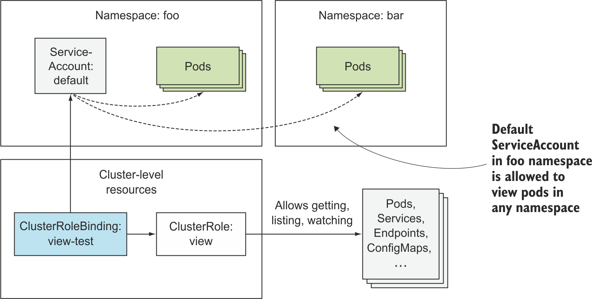
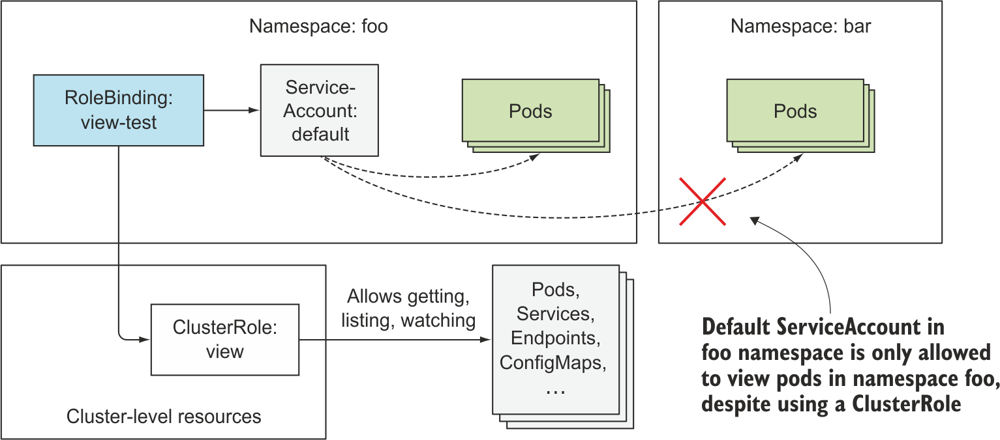

# 쿠버네티스 API 서버 보안

## 주요 내용

1. 인증에 대한 이해
2. 서비스어카운트란 무엇이며 사용하는 이유?
3. 역할 기반 액세스 제어(RBAC) 플러그인 이해
4. 롤과 롤바인딩 사용
5. 클러스터롤과 클러스터롤바인딩 사용
6. 디폴트 롤과 바인딩 이해

## 1. 인증 이해

_인증 플러그인은 다음 방법을 사용해 클라이언트의 아이덴티티를 얻는다._

- 클라이언트의 인증서
- HTTP 헤더로 전달된 인증 토큰
- 기본 HTTP 인증
- 기타

### 1.1. 사용자와 그룹

- 인증 플러그인은 인증된 사용자의 **_사용자 이름과 그룹을 반환_**한다. k8s는 해당 정보를 저장하지 않는다.

**사용자**: API 서버에 접속하는 두 종류의 클라이언트를 구분한다. 둘 다 인증 플러그인을 사용해 인증된다.

- 실제 사람(사용자)
  - 사용자 계정을 나타내는 자원은 없다. -> API 서버를 통해 사용자를 생성, 삭제할 수 없다는 뜻이다.
- 파드(파드 내에서 실행되는 애플리케이션)
  - 서비스어카운트라는 메커니즘을 사용, 클러스터에 서비스어카운트 리소스로 생성되고 저장된다.
  - 파드를 실행하는 데에 서비스어카운트가 필수이므로 자세히 다룬다.

**그룹**: 휴먼 사용자와 서비스어카운트는 하나 이상의 그룹에 속할 수 있다. 그룹은 한번에 여러 사용자에게 권한을 부여하는 데에 사용된다.  
내장 그룹

- system:unauthenticated: 어떤 플러그인에서도 클라이언트를 인증할 수 없는 요청
- system:authenticated: 성공적으로 인증된 사용자에게 자동으로 할당
- system:serviceaccounts: 시스템의 모든 서비스어카운트를 포함
- system:serviceaccounts:\<namespace\>는 특정 네임스페이스의 모든 서비스어카운트를 포함한다.

### 1.2. 서비스어카운트(SA)

- 모든 파드는 파드에서 실행 중인 애플리케이션의 아이덴티티를 나타내는 서비스어카운트와 연계돼있다.
- 토큰 파일은 서비스어카운트의 인증 토큰을 가지고 있다. 시크릿 볼륨으로 각 컨테이너의 파일시스템에 마운트된 `/var/run/secrets/kubernetes.io/serviceaccount/token` 파일.
- 애플리케이션이 이 토큰을 사용해 API 서버에 접속하면, 인증 플러그인이 SA를 인증하고 사용자 이름을 API 서버 코어로 전달한다. 서비스 어카운트의 사용자 이름은 `system:serviceaccount:<namespace>:<service account name>` 형식이다.
- 인가 플러그인이 사용자 이름을 받아서 애플리케이션이 수행하려는 작업을 SA에서 수행할 수 있는지 결정한다.

SA 리소스는 파드, 시크릿, 컨피그맵 등과 같은 리소스이며 개별 네임스페이스로 범위가 지정된다. 각 네임스페이스마다 default sa가 자동으로 생성된다. (우리가 따로 지정하지 않았을 때 사용되었던 sa)

```bash
k get sa
```



- 각 파드는 해당 네임스페이스에 있는 단 하나의 서비스와 연계되지만 (파드 메니페스트에 sa를 지정하여 할당할 수 있다)
- 하나의 서비스어카운트는 여러 파드와 연결될 수 있다.

1. API 서버가 인증토큰이 있는 요청을 수신하면
2. API 서버는 토큰을 사용해 요청을 보낸 클라이언트를 인증한 다음
3. 관련 sa가 요청된 작업을 수행할 수 있는지 여부를 결정한다.
4. API 서버는 클러스터 관리자가 구성한 시스템 전체의 인가 플러그인에서 이 정보를 얻는다. (3번 정보)

### 1.3. 서비스어카운트 생성

**왜 default sa 외에 여러 sa가 필요한가?**  
클러스터 보안 때문. 클러스터 메타데이터를 읽을 필요가 없는 파드는 클러스터에 배포된 리소스를 검색하거나 수정할 수 없는 계정으로 실행, 메타데이터를 검색해야 하는 파드는 해당 오브젝트의 메타데이터만 읽을 수 있는 sa로 실행, 오브젝트를 수정해야 하는 파드는 API 오브젝트를 수정할 수 있는 고유한 sa로 실행.

```bash
k create serviceaccount foo
k create sa foo
```

```bash
$ k describe sa foo

Name:                foo
Namespace:           default
Labels:              <none>
Annotations:         <none>
Image pull secrets:  <none> # 파드에 이 필드의 값이 자동으로 추가된다.
Mountable secrets:   foo-token-xd7f7 # 마운트 가능한 시크릿이 강제화된 경우 이 sa를 사용하는 파드만 해당 시크릿을 마운트할 수 있다.
Tokens:              foo-token-xd7f7 # 인증 토큰. 첫 번째 토큰이 컨테이너에 마운트된다.
Events:              <none>
```

```bash
$ k describe secret foo-token-xd7f7 # default secret과 같은 구성

Name:         foo-token-xd7f7
Namespace:    default
Labels:       <none>
Annotations:  kubernetes.io/service-account.name: foo
              kubernetes.io/service-account.uid: 14038b30-79c1-4e6d-b292-c374f7ce103b

Type:  kubernetes.io/service-account-token

Data
====
ca.crt:     1111 bytes
namespace:  7 bytes
token:      eyJhbGciOiJSUzI1...
```

- sa의 이미지 풀 시크릿은 각각 파드가 어떤 이미지 풀 시크릿을 사용할 수 있는지 결정하는 것이 아니라 sa와 연결된 모든 파드에 특정 이미지 풀 시크릿을 자동으로 추가한다. 개별적으로 추가할 필요 x

```yaml
# sa-image-pull-secrets.yaml
apiVersion: v1
kind: ServiceAccount
metadata:
  name: my-service-account
imagePullSecrets:
  - name: my-dockerhub-secret
```

### 1.4. 파드에 서비스어카운트 할당

파드 정의의 spec.serviceAccountName 필드에 sa를 설정하면 된다. **나중에 변경할 수 없다!**

```yaml
# curl-custom-sa.yaml
apiVersion: v1
kind: Pod
metadata:
  name: curl-custom-sa
spec:
  serviceAccountName: foo # sa 설정
  containers:
    - name: main
      image: curlimages/curl # tutum/curl에 접근이 불가능함.. log를 보면 여기서 에러
      command: ["sleep", "9999999"]
    - name: ambassador
      image: luksa/kubectl-proxy:1.6.2
```

다른 이미지는 여기에서 [docker hub link](https://hub.docker.com/search?q=curl)

```bash
k exec -it curl-custom-sa -c main cat /var/run/secrets/kubernetes.io/serviceaccount/token
eyJh.... 토큰 내용 출력 가능 foo service account의 토큰임을 확인할 수 있음
```

## 2. 역할 기반 액세스 제어로 클러스터 보안

- 파드 중 하나에서 인증 토큰을 획득하면 클러스터 전체에서 어떤 작업이든 수행이 가능했다. (1.6.0 이전 버전)
- RBAC 인가 플러그인이 많은 클러스터에서 기본적으로 활성화 -> 권한 없는 사용자가 클러스터의 상태를 보거나 수정하지 못하게 한다. (Role Based Access Control)
- API 서버가 인가 플러그인을 사용해 수행 가능 여부 점검 방법: REST 인터페이스를 제공하므로 사용자가 서버에 HTTP 요청을 보내 액션을 수행함.

- get, create, update 등의 동사는 클라이언트가 수행한 HTTP 메서드(GET, POST, PUT)에 매핑된다. 명사(파드, 서비스, 시크릿)는 쿠버네티스 리소스와 정확하게 매핑된다.

| HTTP method | 단일 리소스 verb             | 컬렉션에 관한 verb |
| ----------- | ---------------------------- | ------------------ |
| GET, HEAD   | get (and watch for watching) | list (and watch)   |
| POST        | create                       | n/a                |
| PUT         | update                       | n/a                |
| PATCH       | patch                        | n/a                |
| DELETE      | delete                       | deletecollection   |

### 2.2. RBAC 리소스 소개

- Role, ClusterRole: 리소스에 수행할 수 있는 동사 지정
- RoleBinding, ClusterRoleBinding: 위의 롤을 특정 사용자, 그룹, 서비스어카운트 등에 바인딩
- 롤은 작업을 정의하고, 바인딩은 주체를 정의한다.
  
- 롤과 롤바인딩은 ns가 지정된 리소스이고, 클러스터롤과 클러스터롤바인딩은 ns를 지정하지 않는 클러스터 수준의 리소스이다.

테스트

```bash
k create ns foo
k create ns bar
k run test --image=luksa/kubectl-proxy -n foo
k run test --image=luksa/kubectl-proxy -n bar # 두 개의 ns에서 pod 실행

k exec -it {POD NAME} -n {NS NAME} sh # shell 접속
curl localhost:8001/api/v1/namespaces/foo/services # forbidden
```

- foo 네임스페이스 내의 default 서비스어카운트를 이용해 API 서버로 요청을 보냈는데 -> foo 네임스페이스의 서비스를 나열할 수 없다고 응답했다. -> RBAC가 실제로 작동하고 있다(?) -> 이 서비스어카운트에 이 작업을 허용하는 방법을 배워보자

### 2.3. 롤과 롤바인딩 사용

- foo 네임스페이스에서 서비스를 가져오고(get) 나열(list)할 수 있는 롤을 정의한다.

```yaml
apiVersion: rbac.authorization.k8s.io/v1
kind: Role
metadata:
  namespace: foo # 네임스페이스가 지정되어야 한다. (cf. 클러스터롤은 아님)
  name: service-reader
rules:
  - apiGroups: [""]
    verbs: ["get", "list"] # 개별 서비스를 가져오고, 나열이 허용된다.
    resources: ["services"] # 서비스와 관련 있다 (리소스 지정할 때는 복수형!)
```

```bash
k create -f service-reader.yaml -n foo
k get role -n foo

k create role service-reader --verb=get --verb=list --resource=services -n bar
k get role -n bar
```

- 롤을 생성했으니 바인딩

```bash
k create rolebinding test --role=service-reader --serviceaccount=foo:default -n foo
k get rolebinding -n foo
```



- ns foo 파드가 실행 중인 sa에 바인딩하기 때문에 이제 해당 파드 내에서 서비스를 나열할 수 있다.

```bash
/ # curl localhost:8001/api/v1/namespaces/foo/services
{
  "kind": "ServiceList",
  "apiVersion": "v1",
  "metadata": {
    "resourceVersion": "87210"
  },
  "items": [] # service가 없기 때문에 비어있다. != forbidden
```

- ns bar에도 role을 바인딩하기

```bash
k edit rolebinding test -n foo
```

```yaml
subjects:
  - kind: ServiceAccount
    name: default
    namespace: bar
```

```bash
curl localhost:8001/api/v1/namespaces/foo/services # bar 내부에서 foo의 서비스에 접근
```



### 2.4. 클러스터롤과 클러스터롤바인딩 사용

- ns를 지정하지 않는 클러스터 수준의 RBAC 리소스
- 모든 ns에서 해당 리소스에 액세스 하려면, 또는 새로운 ns를 만들 때 이 롤을 적용하려면 새로 롤과 롤바인딩을 생성해줘야 한다.

```bash
k create clusterrole pv-reader --verb=get,list --resource=persistentvolumes
```

```yaml
apiVersion: rbac.authorization.k8s.io/v1
kind: ClusterRole # 별도로 ns를 정의하지 않는다.
metadata:
  name: pv-reader
rules:
  - apiGroups: [""]
    verbs: ["get", "list"]
    resources: ["persistentvolumes"]
```

- 각 pod에서 pv를 나열할 수 있는지 확인하고

```bash
curl localhost:8001/api/v1/persistentvolumes # forbidden
```

- rolebinding을 생성은 할 수 있는데.. 접근이 불가능할 거다.

```bash
k create rolebinding pv-test --clusterrole=pv-reader --serviceaccount=foo:default -n foo
```

- clusterrolebinding 생성

```bash
$ k create clusterrolebinding pv-test --clusterrole=pv-reader --serviceaccount=foo:default # apiversion이 업데이트가 된 듯?
error: no matches for kind "ClusterRoleBinding" in version "rbac.authorization.k8s.io/v1beta1"
```

```yaml
# pv-reader-clusterrolebinding.yaml
apiVersion: rbac.authorization.k8s.io/v1
kind: ClusterRoleBinding
metadata:
  name: pv-test
subjects:
  - kind: ServiceAccount
    name: default
    namespace: foo
roleRef:
  kind: ClusterRole
  name: pv-reader
  apiGroup: rbac.authorization.k8s.io
```

참고: [rbac docs](https://kubernetes.io/docs/reference/access-authn-authz/rbac/)

```bash
k create -f pv-reader-clusterrolebinding.yaml
k get clusterrolebinding

# foo pod 내에서
curl localhost:8001/api/v1/persistentvolumes # 가능
```



- cluster 수준의 리소스에 접근하기 위해서는 필수적으로 cluster role - cluster role binding이 필요하다.

**리소스가 아닌 url에 액세스 허용하기**

- system:discovery라는 클러스터롤에서 url 접근을 허용하고 있다.
- 이 클러스터롤과 클러스터롤바인딩을 참고해보자.

```bash
k get clusterrole system:discovery -o yaml # nonResourceURLs, verbs
k get clusterrolebinding system:discovery -o yaml

apiVersion: rbac.authorization.k8s.io/v1
kind: ClusterRoleBinding
metadata:
(...)
roleRef: # system:discovery clusterrole 참조
  apiGroup: rbac.authorization.k8s.io
  kind: ClusterRole
  name: system:discovery
subjects: # 인증된 사용자만 이 클러스터롤에 바인드
- apiGroup: rbac.authorization.k8s.io
  kind: Group
  name: system:authenticated
```

**클러스터롤이 항상 클러스터 수준 클러스터롤바인딩과 바인딩될 필요는 없다. 네임스페이스를 갖는 롤바인딩과 바인딩 될 수도 있다.**

기본 clusterrole인 view를 살펴보자

```bash
k get clusterrole view -o yaml

rules:
- apiGroups:
  - ""
  resources: # ns 수준의 리소스들
  - configmaps
  - endpoints
  - persistentvolumeclaims
  - persistentvolumeclaims/status
  - pods
  - replicationcontrollers
  - replicationcontrollers/scale
  - serviceaccounts
  - services
  - services/status
  verbs: # 사용 가능한 액션
  - get
  - list
  - watch # 볼 수 있다.
```

- 클러스터롤바인딩으로 묶으면 바인딩에 나열된 주체는 모든 ns에 있는 지정된 리소스들을 볼 수 있다.
- 롤바인딩을 만들면 롤바인딩의 ns에 있는 리소스만 볼 수 있다.

테스트

- 먼저 모든 네임스페이스와 특정 네임스페이스의 파드를 나열하도록 한다.

```bash
# exec foo 에서
curl localhost:8001/api/v1/pods # cluster scope의 파드를 나열할 수 없다.
curl localhost:8001/api/v1/namespaces/foo/pods # namespace foo의 파드를 나열할 수 없다.
```

- 클러스터롤바인딩을 생성해본다.

```yaml
# view-test.yaml
apiVersion: rbac.authorization.k8s.io/v1
kind: ClusterRoleBinding
metadata:
  name: view-test
subjects:
  - kind: ServiceAccount
    name: default
    namespace: foo
roleRef:
  kind: ClusterRole
  name: view
  apiGroup: rbac.authorization.k8s.io
```

- cluster 수준의, 그리고 각 ns 수준의 파드 나열 가능

```bash
curl localhost:8001/api/v1/namespaces/foo/pods
curl localhost:8001/api/v1/namespaces/bar/pods
curl localhost:8001/api/v1/pods
```



- ns foo의 sa는 모든 ns의 파드를 볼 수 있다.

- 클러스터롤바인딩을 삭제하고 특정 ns와의 롤바인딩만으로 바인딩해본다.

```bash
k delete clusterrolebinding view-test
```

```bash
k create rolebinding view-test --clusterrole=view --serviceaccount=foo:default -n foo
```

- ns foo의 파드만 조회가 가능할 것이다.

```bash
curl localhost:8001/api/v1/namespaces/foo/pods
curl localhost:8001/api/v1/namespaces/bar/pods
curl localhost:8001/api/v1/pods
```



- ns foo에만 롤바인딩을 해주면 다른 ns의 파드에는 접근이 불가능해진다.

### 롤, 클러스터롤, 롤바인딩과 클러스터롤바인딩 조합에 관한 요약

| 접근                                                 | 롤 타입    | 사용할 바인딩 타입 |
| :--------------------------------------------------- | :--------- | :----------------- |
| 클러스터 수준 리소스(노드, pv 등)                    | 클러스터롤 | 클러스터롤바인딩   |
| 리소스가 아닌 URL(/api, /healthz, ...)               | 클러스터롤 | 클러스터롤바인딩   |
| 모든 ns의 ns 단위 리소스                             | 클러스터롤 | 클러스터롤바인딩   |
| 특정 ns의 ns 단위 리소스(여러 ns에 동일한 롤 재사용) | 클러스터롤 | 롤바인딩           |
| 특정 ns의 ns 단위 리소스(각 ns에 롤 지정)            | 롤         | 롤바인딩           |

### 2.6. 인가 권한 현명하게 부여하기

> 각 파드를 위한 특정 서비스어카운트를 생성한 다음 롤바인딩으로 맞춤형 롤(또는 클러스터롤)과 연께하는 것이 바람직한 접근 방법이다.  
> 예를 들어, 파드1은 읽는 기능, 파드2는 수정 기능이 필요할 때 서로 다른 2개의 sa를 만들고 각 파드 스펙의 serviceAccountName에 각각 설정하여 사용하라. 모든 권한을 디폴트 sa에 추가하지 마라.

## 3. 요약

- API 서버 클라이언트: 사용자, 파드에서 실행되는 애플리케이션 모두 포함
- 파드는 각 네임스페이스에 자동으로 생성되는 default sa에서 실행된다.
- 추가적으로 sa를 생성하여 파드와 연계할 수 있다.
- sa는 이미지 풀 시크릿을 파드에 첨부하는 데도 사용할 수 있으므로 모든 파드에 시크릿을 지정할 필요는 없다.
- 롤과 클러스터롤은 어떤 리소스에 어떤 작업(verb)을 수행할 수 있는지 정의한다.
- 롤바인딩과 클러스터롤바인딩의 차이
- 각 클러스터에는 디폴트 클러스터롤과 클러스터롤바인딩이 제공된다.
